 

## hey

i'm s1mos. self-taught dev from spain. i build software i'd actually use myself, and stream sometimes.

heads up: most of my code lives in private repos and client work, so the green-square heatmap up there undersells what's actually going on. the projects below + my site are the real signal.

 

## right now

<table>
<tr>
<td valign="top" width="50%">

### 📡 InstantClone

free, open-source RTMP delay proxy for streamers. wrote it because the polished one was paid and i wanted something i could rebuild from scratch.
   
· [github →](https://github.com/Soulhackzlol/instantclone) · rust · windows

</td>
<td valign="top" width="50%">

### 🛰 Crossr

the on-demand script runner that should have existed 10 years ago. write a script once in CrossrScript, paste a curl on any machine, watch the output stream live in your browser. same script compiles to bash on linux + powershell on windows. no agent, no per-device pricing.
 
· in the works · ts · next · electron
  
</td>
</tr>
</table>

**smaller stuff** &nbsp;·&nbsp; mostly next.js side things. one example: **[stream-ads](https://s1moscs.dev/streaming)** lets viewers send me joke ads, i pick the good ones, they show as an overlay on stream. the rest live on [s1moscs.dev](https://s1moscs.dev).

 

## stack

**reach for daily**

**touched, comfortable enough**

 

## find me

dms open on twitter and discord. site has the email if it's important.

 

---

<i>"never give up. it's all a process."</i>

 
 

currently listening to: <b>whatever's loud</b> &nbsp;·&nbsp; building: <b>Crossr</b> &nbsp;·&nbsp; reading: <b>nothing, sorry</b>

